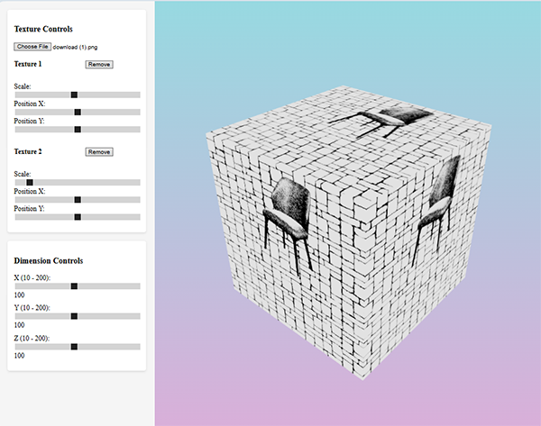

# A React-based 3D viewer for applying custom textures to models with real-time transformations.

 


## Key Features

- **Dynamic Model Loading**: Fetches GLB models and measurements from API endpoint
- **Multi-Texture Support**: 
  - Upload and overlap multiple textures (currently supports more than two uploads, but can be limited to two if needed)
  - Textures stack in array order (last uploaded appears on top)
  - Individual texture removal capability
- **Precise Texture Control**:
  - Position adjustment (X/Y axis)
  - Scale transformation
  - color quantization (hard-coded black/white)
- **Responsive Design**: Adapts to desktop 
- **Dimension Control**: Adjust model size within API-specified limits

## Technical Implementation

### Core Technologies
- **Three.js** via React Three Fiber (R3F)
- **Drei** for Three.js helpers and abstractions
- **Vite** for ultra-fast development builds

## Requirements
- Node.js (v14+)
- npm or yarn

## Installation
1. Clone the repository
2. Install dependencies:
   ```bash
   npm install
3. Run App:
   ```bash
   npm run dev